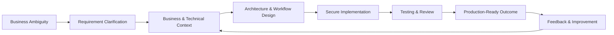
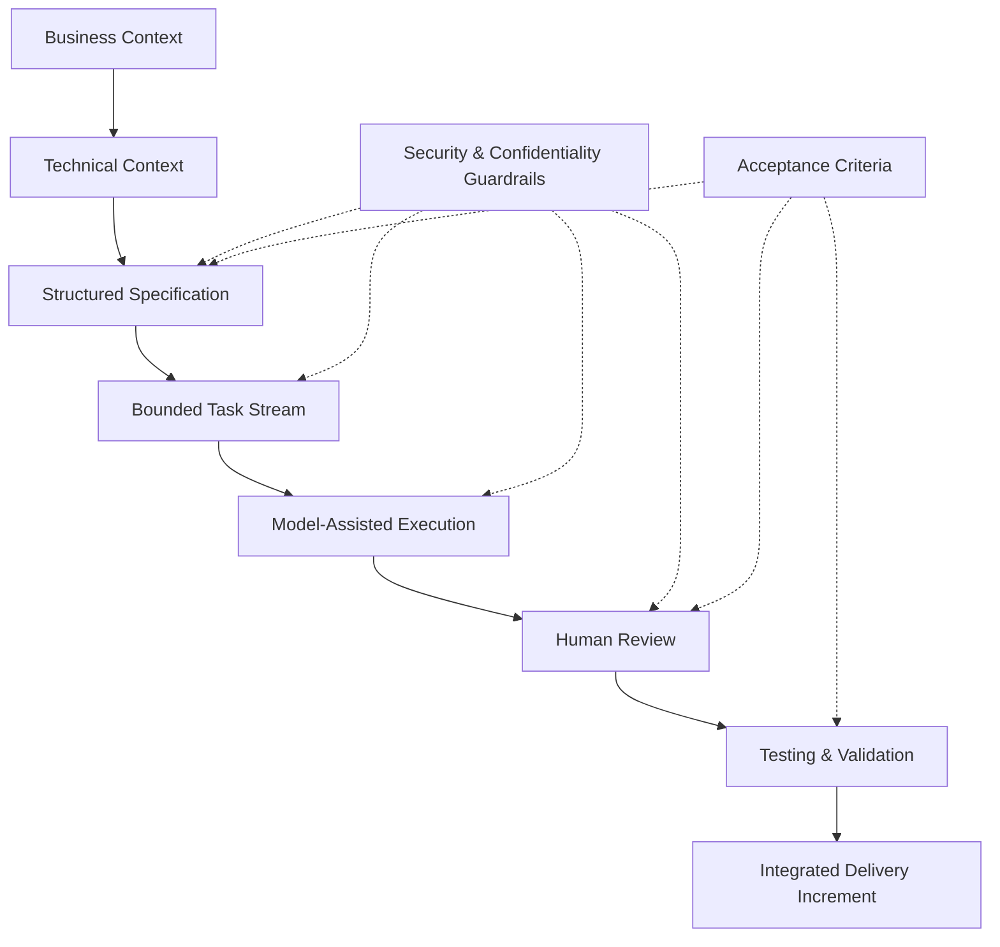

# 🧭 Phạm Đỗ Nhật Minh

### Senior Technical Consultant · Enterprise Data & Workflow Systems · Java/Spring Boot · PostgreSQL · Flowable · Next.js · Model-Assisted Delivery

I help enterprise teams turn unclear business needs into secure, scalable, production-ready software systems.

---

## 🧩 About me

I am a Vietnamese full-stack software engineer and **Senior Technical Consultant** based in Ho Chi Minh City, with **5+ years of enterprise software delivery experience** across financial-services platforms, data workflow systems, business-process automation, electronic toll collection, low-code applications, and production-critical enterprise systems.

Most of my recent professional work is client-confidential, so I describe it at a capability and outcome level only.

---

## 🧭 Current focus

- 🏦 **Enterprise data & workflow systems** — data platforms, business-process automation, internal operations, and operational visibility.
- ☕ **Java / Spring engineering** — backend services, REST APIs, enterprise systems, production support, and secure implementation.
- 🐘 **PostgreSQL & data optimisation** — indexing, partitioning, query optimisation, ETL restructuring, and multi-terabyte-scale data handling.
- 🔄 **Workflow orchestration** — Flowable, Apache NiFi, Apache Airflow, and custom data-processing workflows.
- ⚛️ **Modern frontend delivery** — Next.js, React, TypeScript, shadcn/ui, Angular, Vue.js, and SSR-oriented user experiences.
- 🔐 **Security-aware delivery** — RBAC, JWT-based authentication, OAuth-oriented patterns, access-control boundaries, and application hardening.
- 🧪 **Testing & delivery confidence** — API E2E testing, browser E2E testing, Cucumber, Serenity, Selenium, JUnit, and release validation.
- 🤖 **Model-assisted delivery workflows** — structured specifications, context engineering, validation checklists, review gates, and human-in-the-loop execution using GPT, Sonnet, and Opus models.

---

## 🏗️ How I approach delivery

I am focused on becoming the kind of technical consultant who can move between business ambiguity and engineering execution without losing sight of delivery quality.

For me, good technical consulting means:

- 🧠 understanding the real business problem before jumping into implementation;
- 🧭 making technical trade-offs visible to stakeholders;
- 🏗️ designing systems that can evolve under real delivery constraints;
- 🔐 treating security, maintainability, and reviewability as part of delivery, not afterthoughts;
- 🧪 validating work through tests, reviews, and production-readiness checks;
- 🤖 using models as delivery leverage while keeping human judgement responsible for quality.

---

## 🛠️ Core toolbox

### ☕ Backend & enterprise systems

### 🐘 Data, workflow & automation

### ⚛️ Frontend

### 🧪 Testing, quality & delivery

---

## 🤖 How I think about model-assisted delivery

I do not see AI in software delivery as “let the model write code and hope for the best”.

The useful pattern is a governed workflow:

What matters most:

- 📚 structured context;
- 🧩 clear specifications;
- ✅ acceptance criteria;
- 🧪 testing expectations;
- 🔐 security and confidentiality guardrails;
- 👀 human review gates;
- 📦 small, reviewable delivery increments.

Models are useful when the surrounding delivery system is disciplined.

---

## 📌 Selected public projects

These projects are earlier public work and learning projects. They show technical breadth, while my recent professional work is mostly client-confidential.

### 📚 JustClass — Classroom Management Backend

Backend developer in a 2-person team building the Spring Boot backend for a classroom management application inspired by Google Classroom.

- **Stack:** Spring Boot, Java 11, Maven, Google Cloud Platform, App Engine, Firestore, Flutter
- **Repository:** [justclass-backend-app](https://github.com/minhphamdonhat/justclass-backend-app)

---

### 🌍 Flaguru — Mobile Quiz Game

Logic and backend developer in a 5-person team building a Flutter/Dart Android quiz game about world flags, with real-time scoring and a ratio-based classification strategy to adjust question difficulty.

- **Stack:** Flutter, Dart, SQLite, Firebase
- **Repository:** [flaguru](https://github.com/minhphamdonhat/flaguru)

---

### 📖 Library Management

Full-stack learning project using Angular, Spring Boot, Google App Engine, and Firebase Auth.

- **Stack:** Angular, Spring Boot, Google App Engine, Firebase Auth
- **Repository:** [library-management](https://github.com/minhphamdonhat/library-management)

---

### ✅ Reminder / Task Management App

Task-management application inspired by Microsoft To Do.

- **Stack:** .NET 5, React, Entity Framework, SQLite, IdentityServer4
- **Repository:** [dotnet_reminder](https://github.com/minhphamdonhat/dotnet_reminder)

---

### ☁️ Spring GCloud Demo

Sample book-management application exploring Spring Boot deployment with Google Cloud services.

- **Stack:** Spring Boot, Google App Engine, Cloud SQL, Cloud Storage
- **Repository:** [spring-gcloud-demo](https://github.com/minhphamdonhat/spring-gcloud-demo)

---

## 🧪 Public showcase ideas I want to add next

I would like my public GitHub to better reflect my current senior consultant direction. Possible future showcase repositories:

- 🏦 **Enterprise workflow demo** — Next.js + Spring Boot + PostgreSQL + Flowable + RBAC.
- 🤖 **Spec-driven delivery template** — reusable structure for requirements, technical context, task breakdowns, validation gates, and review notes.
- 🐘 **PostgreSQL optimisation lab** — partitioning, indexing, pagination, and query-plan examples on synthetic data.
- 🧪 **E2E testing starter** — Cucumber + Serenity examples for API and browser-level workflows.

---

## 🧠 Principles I keep returning to

- 🧭 Context before implementation.
- ⚖️ Trade-offs over silver bullets.
- 🔐 Security and maintainability are delivery concerns.
- 🧪 Tests make confidence visible.
- 📦 Small increments beat vague progress.
- 🤖 Models amplify workflow quality; they do not replace engineering judgement.
- 🤝 Trust is built through clarity, ownership, and follow-through.

---

## 🤝 Connect

- 💼 LinkedIn: [linkedin.com/in/minhphamdonhat](https://www.linkedin.com/in/minhphamdonhat/)
- 🧑‍💻 GitHub: [github.com/minhphamdonhat](https://github.com/minhphamdonhat)
- 📍 Ho Chi Minh City, Vietnam

---

### 🧭 Build clearly · Ship responsibly · Improve continuously

